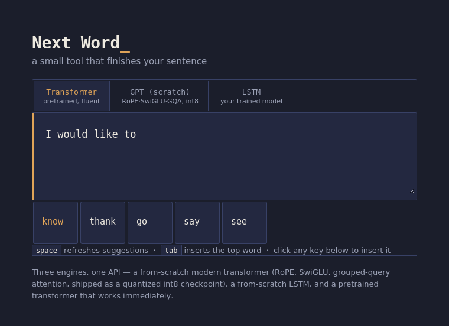

# Next Word Prediction

A complete, ready-to-run next-word-prediction system with **two swappable
prediction engines**, a **FastAPI backend**, a **web interface**, and a
**pretrained model included out of the box**.

This project was built as a consolidated, production-quality upgrade of
several smaller reference implementations (an n-gram/Markov-chain
predictor, a word-level LSTM, a RoBERTa masked-language-model predictor,
and a federated-learning research repo) — combining what works best from
each into one coherent, working system rather than several disconnected
scripts.

<p align="center">
  
</p>

<p align="center"><sub>The web interface: type a sentence, get ranked next-word suggestions in real time, click or press <kbd>Tab</kbd> to insert.</sub></p>

---

## Contents

- [Overview](#overview)
- [Methodology](#methodology)
- [Technology stack](#technology-stack)
- [Project structure](#project-structure)
- [Setup](#setup)
- [Usage](#usage)
- [Design notes](#design-notes)

---

## Overview

Given a piece of text the user is typing, the system predicts the most
likely next word(s), ranks them by probability, and displays them for
one-click insertion — the same interaction pattern as a phone keyboard's
predictive-text bar, generalized to two different prediction strategies:

| | LSTM engine | Transformer engine |
|---|---|---|
| **Needs training?** | No — pretrained model included; retrain any time on your own text | No — pretrained DistilBERT, works immediately |
| **Learns from** | Whatever text you train it on (ships trained on Shakespeare) | A huge general-English corpus, already learned by DistilBERT |
| **Strength** | Picks up the vocabulary/style of *your* specific text | Fluent, grammatically aware general-purpose completion |
| **Cost** | Fast, ~22MB model | Slower on CPU, ~250MB download |

Both engines sit behind the same `/predict` API and the same UI toggle, so
they're directly comparable and interchangeable.

## Methodology

The prediction task is framed as **language modelling**: given a sequence
of preceding words `w₁, w₂, ..., wₙ`, estimate a probability distribution
over the vocabulary for `wₙ₊₁`, and return the top-k most likely words.

**LSTM engine — trained from scratch:**
1. **Corpus ingestion** — the training text is split into lines/sentences
   so the model never learns spurious transitions across unrelated chunks.
2. **Tokenization** — a Keras `Tokenizer` builds a word ↔ integer vocabulary
   (capped at 8,000 words; out-of-vocabulary words map to a single `<OOV>`
   token).
3. **Sequence generation** — every sentence is expanded into overlapping
   n-gram prefixes (`[w₁,w₂] → w₃`, `[w₁,w₂,w₃] → w₄`, ...), each capped
   at 20 tokens of context, giving the model many training examples per
   sentence.
4. **Model** — `Embedding → LSTM(150) → Dropout → LSTM(100) → Dropout →
   Dense(softmax over vocab)`. The embedding layer learns a dense vector
   per word; the stacked LSTMs learn sequential dependencies; the final
   softmax layer outputs a probability for every word in the vocabulary.
5. **Training** — optimized with Adam and sparse categorical
   cross-entropy (labels kept as plain integers rather than one-hot
   vectors, which keeps memory use manageable on larger vocabularies).
   The bundled model was trained for 10 epochs on the full ~1.1MB corpus.
6. **Inference** — the input text is tokenized and padded the same way,
   passed through the network, and the top-k highest-probability words
   are returned.

**Transformer engine — pretrained, zero-shot:**
Rather than training a model, the input text is appended with a `[MASK]`
token and passed to DistilBERT (a masked-language model pretrained on
BookCorpus + English Wikipedia). The model's existing knowledge of English
grammar and semantics is used directly — its predicted distribution over
the mask position *is* the next-word prediction, filtered to keep only
real, complete words and re-ranked to the requested `top_k`.

**Why include both?** They represent two genuinely different approaches
to the same problem — the trade-off between a small model you fully own
and control (LSTM) versus a large model with far more general
world/language knowledge that you don't have to train (transformer) — and
letting you compare them side by side is more useful than picking one.

## Technology stack

| Layer | Technology | Why |
|---|---|---|
| LSTM model | **TensorFlow / Keras** | Standard, well-documented deep learning framework for sequence models; `Tokenizer`/`pad_sequences` utilities handle text preprocessing cleanly. |
| Transformer model | **PyTorch + Hugging Face `transformers`** | Gives direct access to thousands of pretrained masked-language models (DistilBERT by default, swappable to BERT/RoBERTa) with a few lines of code. |
| Backend API | **FastAPI** | Async, typed, automatic request validation via Pydantic, minimal boilerplate, serves both static files and the JSON `/predict` endpoint. |
| Server | **Uvicorn** | ASGI server that runs the FastAPI app. |
| Frontend | **Vanilla HTML / CSS / JavaScript** | No build step, no framework overhead — a single-purpose UI doesn't need one; keeps the whole project runnable with just `pip install` and no `npm`. |
| Data interchange | **JSON over HTTP** | Simple `POST /predict {text, engine, top_k}` → `{suggestions: [...]}` contract, easy to call from anything (curl, Python, the bundled UI). |
| Training corpus | **Public-domain Shakespeare text** | ~1.1MB, ~200k words — large enough to train a meaningful language model, small enough to retrain quickly, and license-free to redistribute. |

## Project structure

```
nwp_project/
├── data/
│   └── corpus.txt              training corpus (Shakespeare, ~1.1MB, public domain)
├── lstm/
│   ├── train_lstm.py           retrain (or train on your own text) whenever you want
│   ├── predict_lstm.py         load the trained model and predict
│   └── model/                  ALREADY TRAINED AND INCLUDED — ready to use out of the box
│       ├── lstm_model.h5       trained weights (10 epochs on the full corpus)
│       ├── tokenizer.pkl       fitted vocabulary
│       └── config.json         sequence length / vocab size metadata
├── transformer/
│   └── predict_transformer.py  pretrained DistilBERT predictor, no training needed
├── app/
│   ├── main.py                 FastAPI server, exposes /predict
│   └── static/                 the web UI (index.html / style.css / script.js)
├── docs/
│   └── screenshot.png          UI screenshot used above
├── requirements.txt
└── README.md
```

**The LSTM model is already trained and included** — you don't need to run
`train_lstm.py` before using it. It reaches ~10% top-1 next-word accuracy
after 10 epochs (i.e. it predicts the *exact* next word about 1 time in
10, and the right *kind* of word considerably more often — normal for a
from-scratch word-level LSTM on a modest corpus). Retrain any time with
your own text.

## Setup

```bash
python -m venv venv
source venv/bin/activate      # Windows: venv\Scripts\activate
pip install -r requirements.txt
```

## Usage

### Run the web app

```bash
cd app
uvicorn main:app --reload --port 8000
```

Open **http://localhost:8000**. Type in the box; suggestions appear as you
type or on space, and <kbd>Tab</kbd> inserts the top suggestion. Switch
between "Transformer" and "LSTM" with the toggle at the top — both work
immediately, no setup required.

### Call the predictors directly from Python

```python
# Transformer — pretrained, no training needed
from transformer.predict_transformer import TransformerPredictor
p = TransformerPredictor()
print(p.predict("The weather today is", top_k=5))

# LSTM — already trained, ships with the repo
from lstm.predict_lstm import LSTMPredictor
p = LSTMPredictor()
print(p.predict("to be or not to", top_k=5))
```

Both return the same shape:
```python
[{"word": "sunny", "probability": 0.41}, {"word": "cold", "probability": 0.18}, ...]
```

### Call the API directly

```bash
curl -X POST http://localhost:8000/predict \
  -H "Content-Type: application/json" \
  -d '{"text": "I would like to", "engine": "transformer", "top_k": 5}'
```

### Retrain the LSTM on your own text

```bash
cd lstm
python train_lstm.py --data ../data/corpus.txt --epochs 30
```

Point `--data` at any UTF-8 `.txt` file — chat exports, notes,
documentation, a specific author's work, anything — one sentence per line
works best. This overwrites `lstm/model/`. For a quick test on a smaller
slice first:

```bash
head -c 200000 ../data/corpus.txt > ../data/corpus_small.txt
python train_lstm.py --data ../data/corpus_small.txt --epochs 10
```

### Swap in a bigger/better transformer

In `transformer/predict_transformer.py`, change:
```python
MODEL_NAME = "distilbert-base-uncased"
```
to `"bert-base-uncased"`, `"roberta-base"`, or `"roberta-large"` for higher
quality at the cost of speed/memory. Any Hugging Face masked-language-model
checkpoint is a drop-in replacement.

## Design notes

For context, here's how the two implemented engines compare to other
common approaches, roughly in order of sophistication:

1. **Markov chains / n-gram frequency tables** — simplest possible
   approach, no machine learning: just "what word most often followed
   this word (or pair of words) in the training text." No real sense of
   meaning, but instant and requires no model.
2. **Word-level LSTM** *(implemented, `lstm/`)* — a small recurrent
   network learns a probability distribution over the vocabulary from
   sequential context. Small, fast, and trainable on modest hardware and
   modest data — but limited to what it has seen.
3. **Pretrained transformer masked-language-model** *(implemented,
   `transformer/`)* — reuses a model already trained on a huge corpus, so
   it understands grammar and context far better with zero training on
   your end, at the cost of size and inference speed.
4. **Federated learning** *(not implemented — noted for completeness)* —
   a research-level extension where the model trains across many users'
   devices without raw text ever leaving the device, aggregating only
   model updates. Genuinely more complex (needs a client/server
   simulation, secure aggregation, etc.); out of scope for a single
   runnable project like this one, but a natural next step if privacy-
   preserving personalization is the goal.
